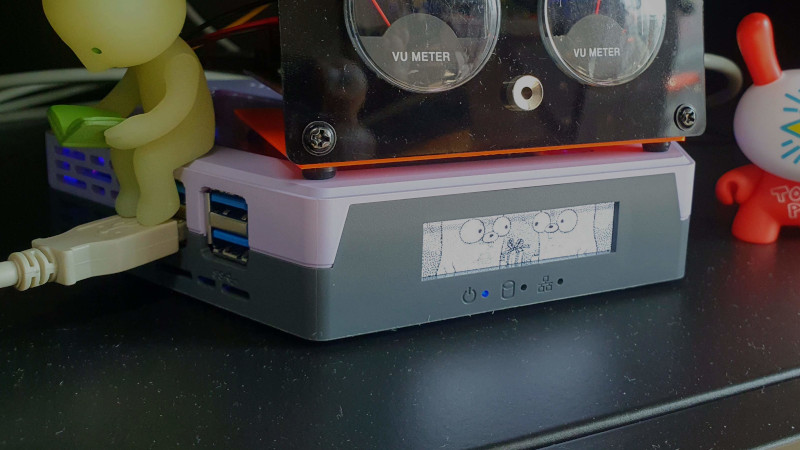

# vraptor_set_display



Set display of V-Raptor SQ nano with given image.
Input image should be size of 256x64 and jpeg or png format.

Example usage:

```bash
$ ./vraptor_set_display -d burkes -p YOUR_PASSWORD Lenna_256x64.png
2022/12/17 13:03:07 success to set image: Lenna_256x64.png
```